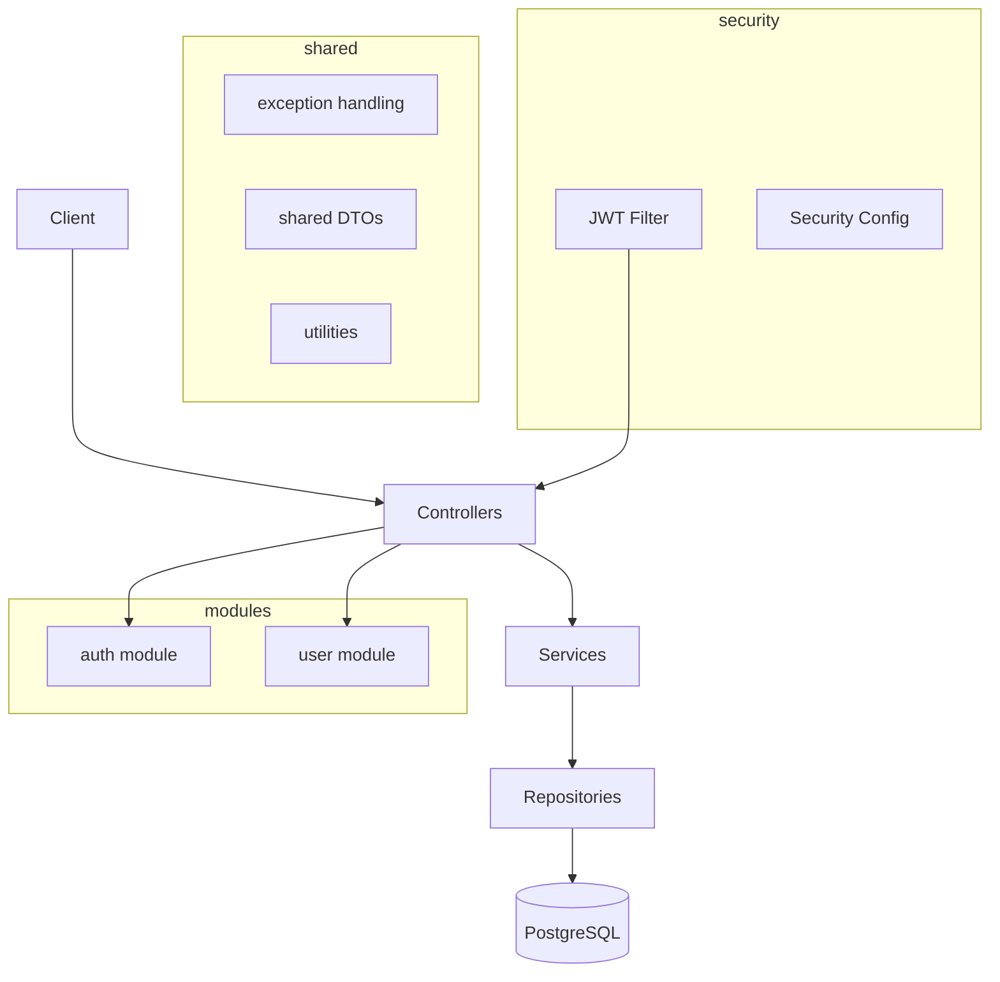

# Spring Boot Starter

A scalable, production-ready Spring Boot starter with JWT authentication, modular architecture, and comprehensive tooling.

## Tech Stack

| Category        | Technology                                  |
|-----------------|---------------------------------------------|
| Language        | Java 21                                     |
| Framework       | Spring Boot 3.4+                            |
| Build           | Gradle (Kotlin DSL)                         |
| Database        | PostgreSQL 16                               |
| ORM             | Spring Data JPA (Hibernate 6)               |
| Migrations      | Flyway                                      |
| Security        | Spring Security 6 + JWT (JJWT 0.12+)       |
| API Docs        | SpringDoc OpenAPI (Swagger UI)              |
| Mapping         | MapStruct 1.6+                              |
| Validation      | Jakarta Bean Validation                     |
| Testing         | JUnit 5, Mockito, Testcontainers            |
| Observability   | Spring Boot Actuator + Micrometer/Prometheus|
| Code Quality    | Checkstyle, Spotless, JaCoCo                |
| Containerization| Docker, Docker Compose                      |

## Architecture



The project uses a **package-by-feature** structure:

```
src/main/java/com/starter/app/
├── config/          # Application configuration
├── security/        # JWT authentication
├── modules/
│   ├── auth/        # Authentication (login, register)
│   └── user/        # User management
└── shared/          # Cross-cutting concerns
    ├── exception/   # Global error handling
    ├── dto/         # Shared DTOs
    └── util/        # Utilities
```

## Local Setup

### Prerequisites

- Java 21+
- Docker & Docker Compose
- Make (optional)

### 1. Start the Database

```bash
make docker-up
# or
docker compose up -d postgres
```

### 2. Set Environment Variables

```bash
export JWT_SECRET=dGhpcyBpcyBhIHZlcnkgbG9uZyBzZWNyZXQga2V5IGZvciBkZXZlbG9wbWVudCBwdXJwb3Nlcw==
```

### 3. Run the Application

```bash
make run
# or
./gradlew bootRun --args='--spring.profiles.active=dev'
```

The API will be available at `http://localhost:8080/api`.

### 4. Open Swagger UI

Navigate to: `http://localhost:8080/api/swagger-ui.html`

## API Endpoints

| Method | Endpoint                   | Description          | Auth Required |
|--------|----------------------------|----------------------|---------------|
| POST   | `/api/v1/auth/login`       | Login                | No            |
| POST   | `/api/v1/auth/register`    | Register new user    | No            |
| GET    | `/api/v1/users/me`         | Get current user     | Yes           |
| PUT    | `/api/v1/users/me`         | Update current user  | Yes           |
| GET    | `/api/actuator/health`     | Health check         | No            |
| GET    | `/api/actuator/prometheus` | Prometheus metrics   | Yes           |

## Environment Variables

| Variable               | Description                | Default (dev)        |
|------------------------|----------------------------|----------------------|
| `JWT_SECRET`           | Base64-encoded HMAC key    | dev key (in config)  |
| `DATABASE_URL`         | JDBC connection string     | `localhost:5432/...` |
| `DATABASE_USER`        | Database username          | `postgres`           |
| `DATABASE_PASSWORD`    | Database password          | `postgres`           |
| `SPRING_PROFILES_ACTIVE` | Active profile           | `dev`                |

## Running Tests

```bash
make test
# or
./gradlew test
```

- **Unit tests**: Run with Mockito (no Spring context)
- **Integration tests**: Use Testcontainers (requires Docker running)
- **Controller slice tests**: Use `@WebMvcTest` with MockMvc

## Code Quality

```bash
# Check formatting and style
make lint

# Auto-format code
make format
```

## License

[MIT](LICENSE)
